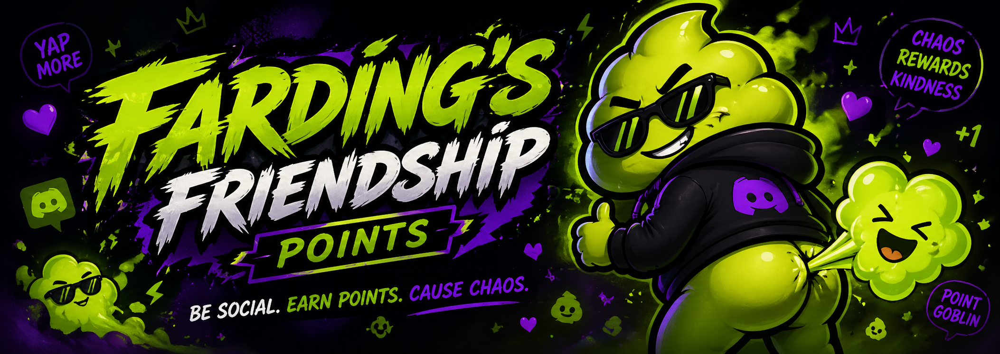

# FarDing's Friendship Points



FarDing's Friendship Points is a chaotic/funny but clean Discord engagement bot. FarDing rewards meaningful server participation with points, public leaderboards, weekly recaps, profiles, and cosmetic titles while trying very hard not to become a spam slot machine.

FarDing is the bot mascot and brand character. The bot copy should feel playful and a little unhinged, but the stats and admin workflows should stay readable first.

## Features

- Slash commands only.
- Lifetime and weekly leaderboards.
- User profiles and detailed stats.
- Admin point adjustments, title controls, and per-guild settings.
- Message, reply, media/link, reaction, solo voice, and group voice scoring.
- Duplicate message suppression, cooldowns, reply-pair throttling, reaction re-add protection, excluded voice channels, and daily voice caps.
- Weekly recap posts with playful labels.
- SQLite persistence with all stats scoped by guild.

## Setup

1. Install dependencies:

```bash
npm install
```

2. Create a private `.env` file and fill in:

```bash
DISCORD_TOKEN=your-bot-token
DISCORD_CLIENT_ID=your-application-client-id
DISCORD_GUILD_ID=your-test-server-id
DATABASE_PATH=./fardings-friendship-points.sqlite
NODE_ENV=development
WEEKLY_CRON=0 9 * * 1
LOG_LEVEL=info
```

3. In the Discord Developer Portal, enable these bot intents:

- Server Members intent is not required for v1.
- Message Content intent
- Guild Messages
- Guild Message Reactions
- Guild Voice States
- Guilds

4. Invite the bot with permissions:

- Send Messages
- Use Slash Commands
- Embed Links
- Read Message History
- Add Reactions optional

5. Register slash commands:

```bash
npm run register
```

6. Run locally:

```bash
npm run dev
```

For production:

```bash
npm run build
npm start
```

## Local MVP Verification

Run the full local code verification pass:

```bash
npm run verify
```

This runs TypeScript typechecking, the test suite, and a production build. It does not log in to Discord and does not require a bot token.

To verify the live bot in a test server:

1. Confirm `.env` exists in the project root.
2. Fill in a real `DISCORD_TOKEN`, `DISCORD_CLIENT_ID`, and test `DISCORD_GUILD_ID`.
3. Confirm Message Content intent is enabled in the Discord Developer Portal.
4. Invite the bot with Send Messages, Use Slash Commands, Embed Links, Read Message History, and voice/reaction access.
5. Register test-server commands:

```bash
npm run register
```

6. Start the bot:

```bash
npm run dev
```

7. Confirm the startup log says FarDing's Friendship Points logged in.
8. Run the manual checklist below in Discord.

## Scoring Defaults

- Text message: 2 points
- Reply to another user: 4 points
- Media/link-only post: 1 point
- Reaction added to another user's message: 1 point
- Solo voice time: 1 point per hour
- Group voice time: 10 points per hour
- Excluded voice channels: 0 points

Replies do not double-count as normal messages. Self-replies, self-reactions, bots, and webhooks do not score.

## Branding And Mascot


- Public bot name: FarDing's Friendship Points
- Mascot name: FarDing
- Points abbreviation: FP
- Current mascot direction: neon green/purple FarDing character with a bold Discord-team style logo

Local brand assets live in `assets/brand/`.

To use the mascot in live Discord embeds, host the image somewhere stable or add an asset pipeline that exposes a public URL. Discord embed thumbnails require a URL that Discord can fetch.

## Commands

Public:

- `/leaderboard`
- `/weekly`
- `/profile [user]`
- `/stats [user]`
- `/friends [user]`
- `/help`

Admin, requiring Manage Server:

- `/config view`
- `/config set-points`
- `/config set-cooldown`
- `/config set-daily-voice-cap`
- `/config exclude-voice-channel`
- `/config include-voice-channel`
- `/weekly-post set-channel`
- `/weekly-post toggle`
- `/points add`
- `/points remove`
- `/points set`
- `/title set`
- `/title clear`

## Weekly Recaps

Set a recap channel and enable posting:

```text
/weekly-post set-channel channel:#recaps
/weekly-post toggle enabled:true
```

The default schedule is Monday at 9:00 AM using the server process timezone. Override with `WEEKLY_CRON`.

## Manual Verification Checklist

- Register slash commands in a test guild with `DISCORD_GUILD_ID` set.
- Run `/help` and confirm the bot responds privately.
- Send a meaningful text message and confirm `/profile` shows message points.
- Reply to another non-bot user and confirm reply points are added once.
- Send an attachment or link-only post and confirm media/link points are added.
- React to another user's message, remove it, then re-add it; confirm it scores only once.
- Run `/points add`, `/points remove`, and `/points set` from an account with Manage Server.
- Run `/title set` and confirm the title appears in `/profile` and `/leaderboard`.
- Join voice alone, then have another non-bot user join, then leave; confirm solo/group voice time appears in `/stats`.
- Exclude and include a voice channel, then confirm excluded voice time does not score.
- Run `/leaderboard`, `/weekly`, `/profile`, and `/stats`.
- Configure weekly recaps with `/weekly-post set-channel` and `/weekly-post toggle`.
- Temporarily set `WEEKLY_CRON` to a near-future schedule in development and confirm a recap posts.
- Stop and restart the bot, then confirm existing points remain in the SQLite database.

## Development

```bash
npm run typecheck
npm test
```

The code is organized so new metrics can be added through the scoring services and repositories without rewriting the command or presentation layers.

## Admin Safety Limits

Admin commands validate inputs before writing to the database:

- Per-action point values: 0-100
- Message/reply cooldowns: 0-86,400 seconds
- Minimum meaningful text length: 1-500 characters
- Daily voice cap: 0-24 hours
- Manual point add/remove amount: 1-1,000,000
- Manual point set total: 0-100,000,000
- Audit reasons: 180 characters
- Titles: 64 characters, no user/role/everyone/here mentions

These limits are enforced both in slash command definitions and inside command handlers.

## Troubleshooting

- `DISCORD_TOKEN and DISCORD_CLIENT_ID are required outside test mode.`
  - Create `.env` in the project root and fill in real Discord application values.
- Slash commands do not appear.
  - For local testing, set `DISCORD_GUILD_ID` and run `npm run register`.
  - Global commands can take longer to appear, so guild registration is better during development.
- The bot logs in but does not score messages.
  - Enable Message Content intent in the Discord Developer Portal.
  - Confirm the bot can read the channel.
- Reaction scoring does not work.
  - Confirm the bot can read message history and receive reaction events.
- Weekly recap does not post.
  - Run `/weekly-post set-channel`, then `/weekly-post toggle enabled:true`.
  - Confirm the bot can send messages and embeds in the configured channel.
- Voice scoring seems missing.
  - Confirm the bot has access to the voice channel and the channel is not excluded.
  - Voice points are hourly rates, so short sessions may record seconds without immediately producing visible points.

## Known Limitations

- SQLite is the intended early/local database. Back up the `.sqlite`, `.sqlite-wal`, and `.sqlite-shm` files together if the bot is running with WAL mode.
- Schema initialization currently uses idempotent table creation. Before larger public use, add a migration version table for safer upgrades.
- Weekly recaps use the process timezone through `WEEKLY_CRON`; per-guild timezones are not implemented yet.
- Weekly recap duplicate-post protection is not implemented yet.
- Voice session recovery avoids awarding downtime after restart, but exact in-progress voice timing across restarts is best-effort.
- There is no web dashboard yet; all configuration is done through Discord slash commands.

## Deployment Notes

- Use an always-on host. Discord bots need a persistent gateway connection, so sleeping free tiers are a bad fit.
- Keep `NODE_ENV=production` in hosted environments.
- Store secrets as host environment variables, not in source control.
- Keep SQLite on persistent disk storage, not ephemeral container storage.
- Start with SQLite for one or a few servers; consider Postgres later if multi-server usage grows or backups/admin tooling become painful.
